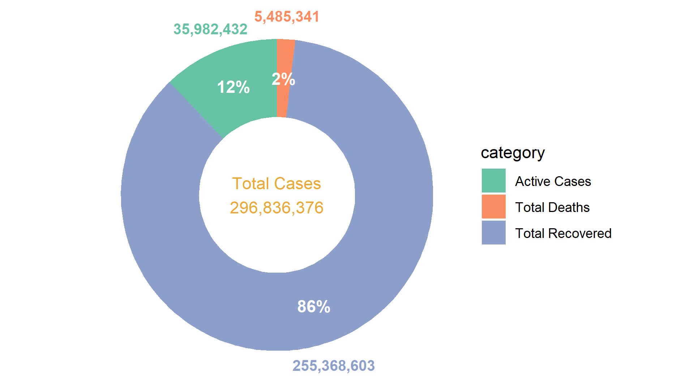
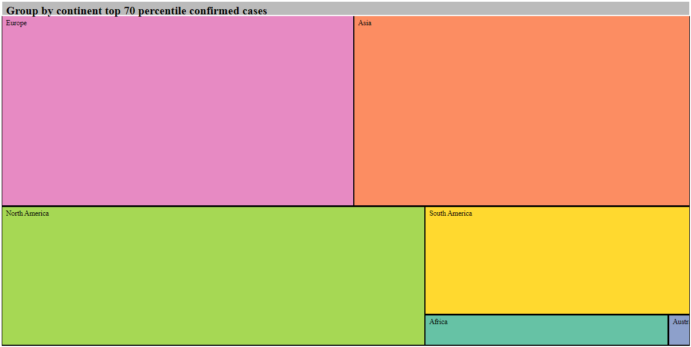
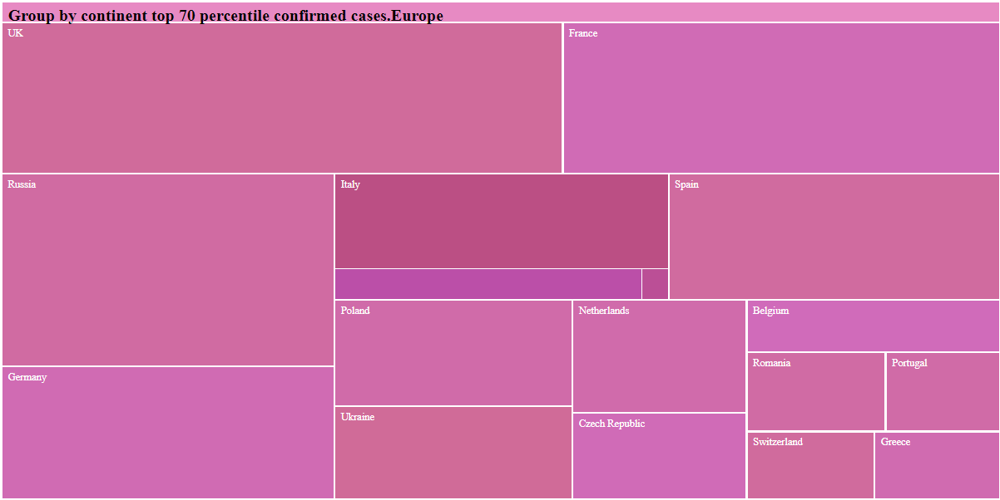
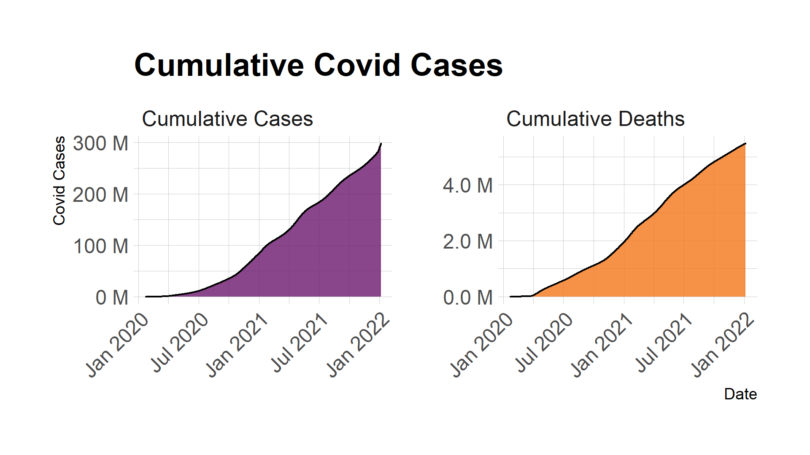
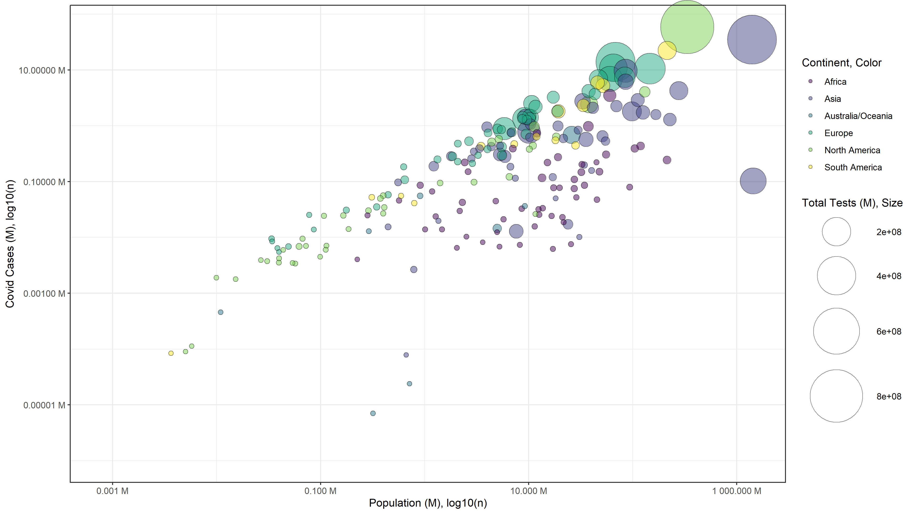

# How to preview GitHub HTML
- Images are embedded directly into markdown.
- Clicking links with postfix `HTML` will open HTML file in editor mode. 
- Click preview link to view rendered HTML, aternatively paste the link of that HTML url into this [website](https://htmlpreview.github.io/).

> These Images are not designed for dark mode.

# Analysis Questions & Answers

1. What is the overview of covid cases? 

    

2. What is the scale of infected population in different continent or country? 

    - [Interactive tree plot HTML](./Output/HTML/qa2.html) - [Preview](http://htmlpreview.github.io/?https://github.com/teoshibin/COMP3021_FIV_covid19_analysis/blob/main/Output/HTML/qa2.html)

    

            
        

            
            
        

    

3. How many people suffered from covid globally?

    - [Interactive area plot HTML](./Output/HTML/qa3.html) -  [Preview](http://htmlpreview.github.io/?https://github.com/teoshibin/COMP3021_FIV_covid19_analysis/blob/main/Output/HTML/qa3.html)
    
    

4. Which country has the most active cases?
    
    

5. How active cases evolve around the world?
    
    

6. Is there any relation between population and Covid cases?   

    - [Interactive bubble plot HTML](./Output/HTML/qb1.html) - [Preview](http://htmlpreview.github.io/?https://github.com/teoshibin/COMP3021_FIV_covid19_analysis/blob/main/Output/HTML/qb1.html)

    

7. temp

    - [temp](./Output/PNG/qa5_cases_proportion.png)

8. temp

    - [temp](./Output/PNG/qa5_cases_proportion.png)

9. temp

    - [temp](./Output/PNG/qa5_cases_proportion.png)

10. temp

    - [temp](./Output/PNG/qa5_cases_proportion.png)