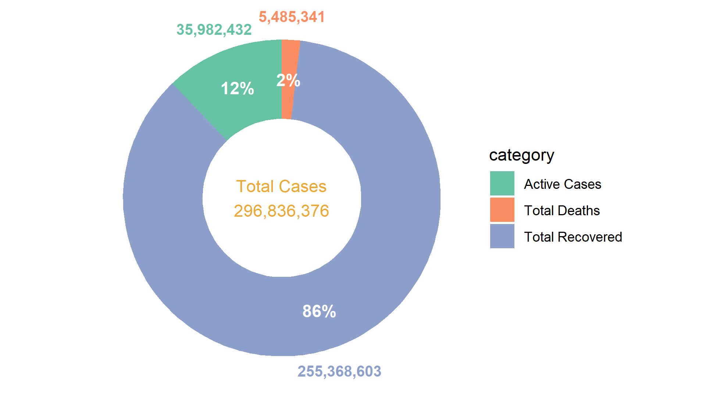
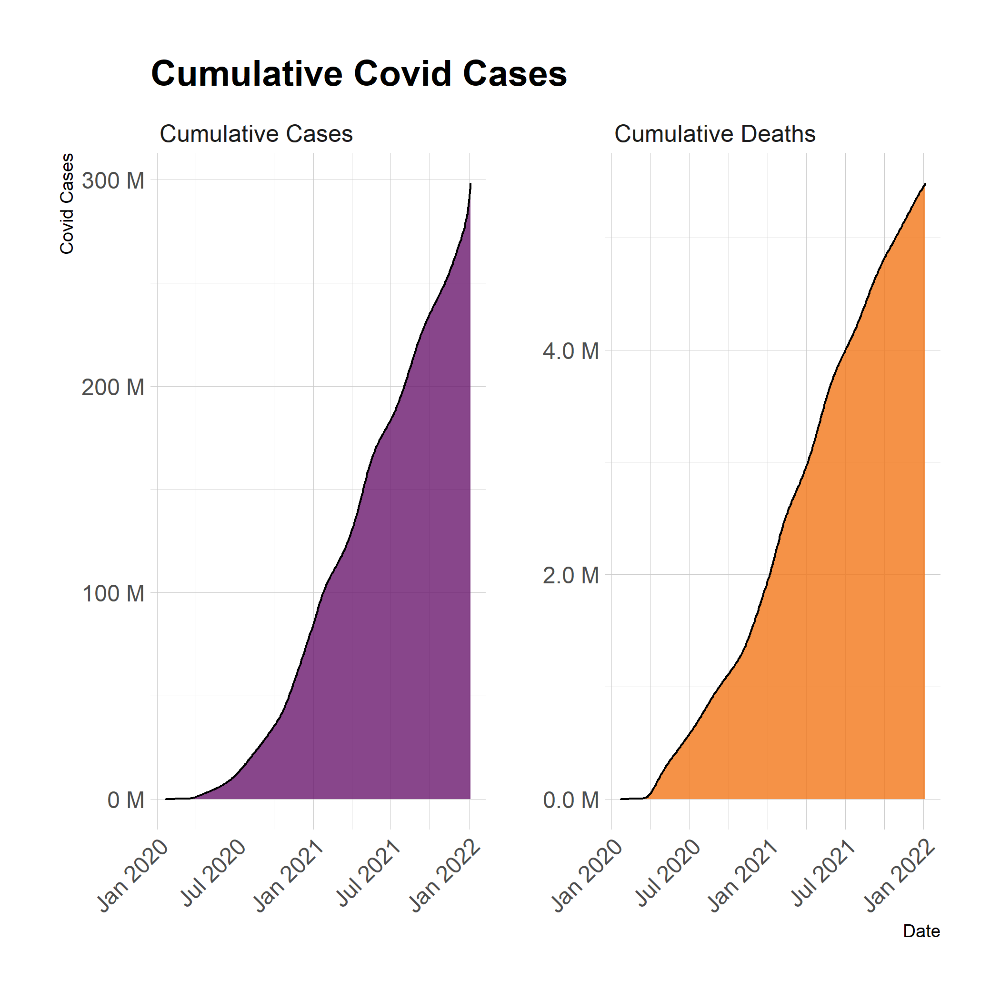

# How to preview GitHub HTML
- Images are embedded directly into markdown.
- Clicking links with postfix `HTML` will open HTML file in editor mode. 
- Click preview link to view rendered HTML, aternatively paste the link of that HTML url into this [website](https://htmlpreview.github.io/).

> These Images are not designed for dark mode.

# Analysis Questions & Answers

1. What is the overview of covid cases? 

    
2. What is the scale of infected population in different continent or country? 
    - [Interactive tree plot HTML](./Output/InteractivePlot/qa2_infection_scale.html) - [Preview](http://htmlpreview.github.io/?https://github.com/teoshibin/COMP3021_FIV_covid19_analysis/blob/main/Output/InteractivePlot/qa2_infection_scale.html)

        
    

        
        
    

3. How many people suffered from covid?
    - [Interactive area plot HTML](./Output/InteractivePlot/qa3_cumulative_cases_by_date.html) -  [Preview](http://htmlpreview.github.io/?https://github.com/teoshibin/COMP3021_FIV_covid19_analysis/blob/main/Output/InteractivePlot/qa3_cumulative_cases_by_date.html)
    
    
4. temp
    - [temp](./Output/StaticPlot/qa4_cases_proportion.png)
5. How active cases evolve starting from the beginning?
    
    
6. Is there any relation between population and Covid cases?   

    - [Interactive bubble plot HTML](./Output/InteractivePlot/qb1_infection_population.html) - [Preview](http://htmlpreview.github.io/?https://github.com/teoshibin/COMP3021_FIV_covid19_analysis/blob/main/Output/InteractivePlot/qb1_infection_population.html)

    
7. temp
    - [temp](./Output/StaticPlot/qa5_cases_proportion.png)
8. temp
    - [temp](./Output/StaticPlot/qa5_cases_proportion.png)
9. temp
    - [temp](./Output/StaticPlot/qa5_cases_proportion.png)
10. temp
    - [temp](./Output/StaticPlot/qa5_cases_proportion.png)